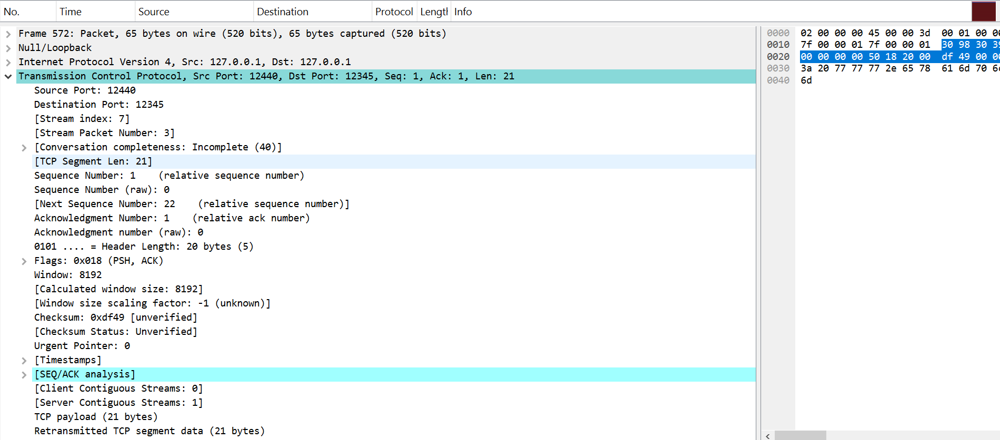

# דוח מסכם: פרויקט תקשורת מחשבים - חלק 1
## אריזת נתונים ולכידת מנות בעזרת Wireshark

**מגישים:** אדיר בוסקילה 209487727 וליאב ויצמן 324926898  
**תאריך:** 11.01.2026  
**קישור ל-GitHub:** [networking-project](https://github.com/...)

---

## מהו פרוטוקול HTTP?

פרוטוקול HTTP (HyperText Transfer Protocol) הוא הפרוטוקול הנפוץ ביותר באינטרנט להעברת מידע. הוא עובד בשכבת היישום של מודל ה-OSI ומבוסס על מודל לקוח-שרת:

- **הלקוח** - בדרך כלל דפדפן או סקריפט, שולח בקשות לשרת
- **השרת** - מקבל את הבקשות, מעבד אותן ומחזיר תשובה עם קוד סטטוס (200 OK, 404 Not Found וכו')
פרוטוקול HTTP רץ מעל TCP כדי להבטיח שהמידע יגיע בשלמותו ובסדר הנכון. לפני כל העברת מידע מתבצע Three-Way Handshake ליצירת החיבור.

---

## יצירת קובץ ה-CSV

יצרנו קובץ בשם `group209487727_http_input.csv` שמכיל 20 הודעות HTTP ו-DNS.

**איך יצרנו את הקובץ:**
השתמשנו ב-Claude AI כדי ליצור הודעות שמדמות תעבורת HTTP אמיתית - בקשות GET, תגובות שרת, שאילתות DNS, ובקשות POST עם JSON.

**מבנה הקובץ:**

| שדה | מה זה |
|-----|-------|
| msg_id | מספר ההודעה |
| app_protocol | HTTP או DNS |
| src_app | מי שולח |
| dst_app | מי מקבל |
| message | תוכן ההודעה |
| timestamp | זמן |

דוגמאות:
```
1,HTTP,client_browser,web_server,GET /index.html HTTP/1.1,0.001
6,HTTP,web_server,client_browser,HTTP/1.1 200 OK,0.050
16,DNS,dns_client,dns_server,Query: www.google.com,0.400
```

---

## תהליך ה-Encapsulation

השתמשנו במחברת `raw_tcp_ip_notebook_fallback_annotated-v1.ipynb` כדי לבנות חבילות TCP/IP מאפס.

**מה קורה בפועל:**

הקוד לא סתם שולח טקסט - הוא בונה את כל השכבות של הפרוטוקול בדיוק כמו שמערכת הפעלה אמיתית עושה:

1. **שכבת היישום** - לוקחים את ההודעה מה-CSV (למשל GET /index.html)

2. **שכבת התעבורה (TCP)** - מוסיפים Header עם:
   - פורט מקור (12440)
   - פורט יעד (12345)
   - דגלים (SYN, ACK, PSH)

3. **שכבת הרשת (IP)** - מוסיפים Header עם:
   - כתובת מקור: 127.0.0.1
   - כתובת יעד: 127.0.0.1

בסוף, הסקריפט שולח את החבילה באמצעות Scapy (כי Windows לא נותן לעבוד ישירות עם raw sockets).

---

## לכידה ב-Wireshark

הפעלנו Wireshark על ממשק ה-Loopback (כי הכל רץ על אותו מחשב), שמנו מסנן `tcp.port==12345`, הרצנו את המחברת ושמרנו את התוצאה בקובץ `part1.pcap`.

---

## ניתוח התעבורה

### תמונה 1 - מה נלכד


מה שרואים פה זה מצב קצת מעניין - הלקוח מנסה לשלוח מידע אבל אין מי שיקבל אותו.

**הפרטים:**
- כתובת מקור ויעד: 127.0.0.1 (הכל מקומי)
- פורט מקור: 12440 (הסקריפט שלנו)
- פורט יעד: 12345 (לשם אנחנו שולחים)

**מה הצבעים אומרים:**

**ירוק (PSH, ACK)** - הלקוח שולח מידע:
- רואים שיש תוכן (Len > 0)
- בתמונה רואים "test message 4" ב-Payload
- הלקוח ממשיך לנסות לשלוח שוב ושוב (TCP Retransmission)

**אדום (RST)** - התשובה מהמערכת:
- RST = Reset, כלומר "אין פה אף אחד, תתנתק"
- WIN=0 כי החיבור נסגר
- LEN=0 כי זו רק הודעת שגיאה

**למה זה קורה?**
אין שרת שמאזין בפורט 12345. מערכת ההפעלה מחזירה RST כי אין מה לעשות עם החבילות.

---

### תמונה 2 - פירוט חבילה בודדת



פה רואים את הפרטים של חבילה אחת:

**שכבת IP:**
- מקור ויעד: 127.0.0.1
- TTL: 64 (ערך סטנדרטי, מראה שזה לא עבר דרך ראוטרים)
- Checksum מופיע כ-Unverified - זה בסדר גמור, מערכת ההפעלה מעבירה את החישוב לכרטיס הרשת

**שכבת TCP:**

| שדה | ערך |
|-----|-----|
| Source Port | 12440 |
| Destination Port | 12345 |
| Sequence Number | 1 |
| Ack Number | 1 |
| Header Length | 20 bytes |
| Flags | PSH, ACK (0x018) |
| Window | 8192 |
| Payload | 21 bytes |

---

## סיכום

בחלק הזה ראינו איך לבנות חבילות TCP/IP מאפס, איך השכבות השונות עוטפות אחת את השנייה, ומה קורה כשמנסים לשלוח מידע למקום שאין בו שרת - המערכת מחזירה RST והלקוח מנסה שוב ושוב עד שמתייאש.

**קבצים:**
- `group209487727_http_input.csv` - 20 הודעות HTTP/DNS
- `raw_tcp_ip_notebook_fallback_annotated-v1.ipynb` - המחברת
- `part1.pcap` - הלכידה מ-Wireshark

---

**אדיר בוסקילה וליאב ויצמן**  
קורס רשתות תקשורת, ינואר 2026
